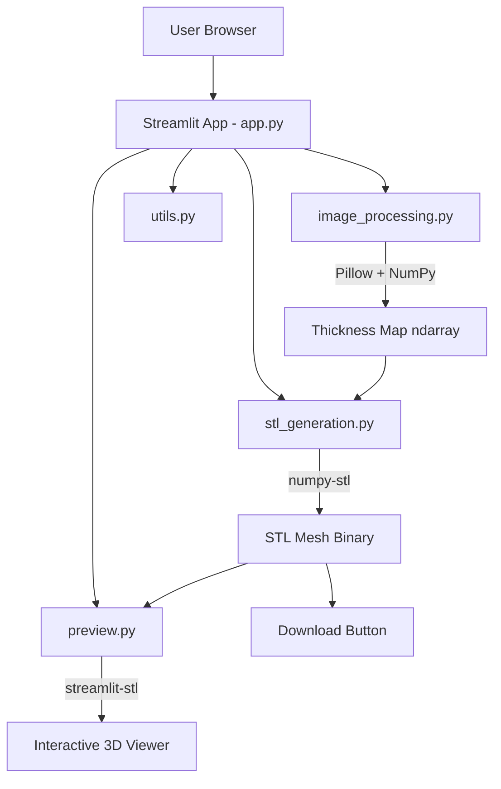

# Design Document: Lithophane Generator

## Overview

The Lithophane Generator is a Streamlit web application that converts uploaded 2D images into 3D-printable lithophane STL files. A lithophane works by varying material thickness so that when backlit, thinner areas appear brighter and thicker areas appear darker — recreating the original image in light and shadow.

The application follows a strictly functional/process-oriented programming style with no classes. The processing pipeline is:

1. **Upload** — User provides a .jpg/.jpeg/.png image
2. **Configure** — User sets target physical dimensions (default 100mm × 100mm)
3. **Process** — Image is resized, converted to grayscale, and mapped to a thickness array
4. **Generate** — Thickness map is triangulated into a watertight STL mesh
5. **Preview** — Side-by-side display of original image and interactive 3D model
6. **Export** — User downloads the binary (or ASCII) STL file

**Key Technology Choices:**
- **Streamlit** — UI framework (rapid prototyping, built-in file upload/download)
- **Pillow (PIL)** — Image loading, resizing, grayscale conversion
- **NumPy** — Array operations for thickness mapping and vertex generation
- **numpy-stl** — STL mesh creation and file export
- **streamlit-stl** — Three.js-based interactive 3D STL viewer component for Streamlit
- **psutil + keyboard** — Graceful application shutdown

## Architecture



The architecture uses a simple modular approach with pure functions organized into focused modules:

| Module | Responsibility |
|--------|---------------|
| `app.py` | Streamlit UI orchestration, layout, session state |
| `image_processing.py` | Image resize, grayscale conversion, thickness mapping |
| `stl_generation.py` | Mesh vertex/face generation, STL file creation |
| `preview.py` | 3D preview rendering via streamlit-stl |
| `utils.py` | Shutdown logic, filename helpers, validation |

**Design Decision — No OOP:** All modules expose pure functions. State flows through function arguments and return values. Streamlit session state is used only at the `app.py` level for UI persistence.

**Design Decision — numpy-stl over trimesh:** numpy-stl is lightweight, has minimal dependencies, and provides direct control over vertex/face arrays which is ideal for the structured grid mesh we generate from height maps. trimesh would add unnecessary complexity for this use case.

**Design Decision — streamlit-stl for preview:** This community component wraps Three.js and supports interactive rotation/zoom/pan of STL files directly in Streamlit, satisfying the interactive preview requirement with minimal integration effort.

## Components and Interfaces

### app.py — UI Orchestration

```python
def main() -> None:
    """Entry point. Configures page, renders UI, orchestrates pipeline."""

def render_upload_section() -> Optional[UploadedFile]:
    """Render file uploader, return uploaded file or None."""

def render_dimension_controls() -> Tuple[float, float]:
    """Render width/height inputs, return (width_mm, height_mm)."""

def render_format_selector() -> str:
    """Render STL format radio button, return 'binary' or 'ascii'."""

def render_results(original_image: Image, stl_bytes: bytes, filename: str) -> None:
    """Render side-by-side comparison and download button."""

def render_shutdown_button() -> None:
    """Render shutdown button with termination logic."""
```

### image_processing.py — Image Pipeline

```python
def validate_file_extension(filename: str) -> bool:
    """Check if filename has an accepted extension (.jpg, .jpeg, .png)."""

def load_image(file_bytes: bytes) -> np.ndarray:
    """Load image bytes into a PIL Image, return as RGB numpy array."""

def resize_image(image: np.ndarray, target_width_mm: float, target_height_mm: float, 
                 pixels_per_mm: float = 1.0) -> np.ndarray:
    """Resize image to fit target dimensions while preserving aspect ratio.
    Returns resized image array."""

def convert_to_grayscale(image: np.ndarray) -> np.ndarray:
    """Convert RGB image to grayscale using standard luminance weights.
    Returns 2D array with values 0-255."""

def compute_thickness_map(grayscale: np.ndarray, 
                          min_thickness: float = 0.4,
                          max_thickness: float = 2.0) -> np.ndarray:
    """Map grayscale intensity to physical thickness.
    Intensity 0 (darkest) -> max_thickness
    Intensity 255 (lightest) -> min_thickness
    Linear interpolation for intermediate values.
    Returns 2D float array in mm."""
```

### stl_generation.py — Mesh Construction

```python
def generate_vertices(thickness_map: np.ndarray, 
                      width_mm: float, 
                      height_mm: float) -> np.ndarray:
    """Generate 3D vertex positions from thickness map.
    Top surface z = thickness_map values.
    Bottom surface z = 0.
    X/Y positions mapped to physical dimensions.
    Returns (N, 3) array of vertex coordinates."""

def generate_top_faces(rows: int, cols: int) -> np.ndarray:
    """Generate triangle face indices for the top surface grid.
    Each grid cell becomes 2 triangles.
    Returns (M, 3) array of vertex indices."""

def generate_bottom_faces(rows: int, cols: int, vertex_offset: int) -> np.ndarray:
    """Generate triangle face indices for the bottom (flat) surface.
    Returns (M, 3) array of vertex indices."""

def generate_side_faces(rows: int, cols: int, vertex_offset: int) -> np.ndarray:
    """Generate triangle face indices for the four perimeter walls.
    Connects top surface edges to bottom surface edges.
    Returns (K, 3) array of vertex indices."""

def create_stl_mesh(thickness_map: np.ndarray, 
                    width_mm: float, 
                    height_mm: float) -> mesh.Mesh:
    """Assemble complete watertight mesh from thickness map.
    Combines top, bottom, and side faces.
    Returns numpy-stl Mesh object."""

def export_stl(stl_mesh: mesh.Mesh, binary: bool = True) -> bytes:
    """Serialize mesh to STL format bytes.
    binary=True for binary STL, False for ASCII STL."""
```

### preview.py — 3D Visualization

```python
def render_stl_preview(stl_bytes: bytes, height: int = 400) -> None:
    """Render interactive 3D preview using streamlit-stl component.
    Supports rotate, zoom, pan via Three.js orbit controls."""
```

### utils.py — Utilities

```python
def generate_output_filename(original_filename: str) -> str:
    """Derive output filename: original_name_lithophane.stl"""

def shutdown_app() -> None:
    """Close browser tab via keyboard simulation, terminate process via psutil."""

def validate_dimensions(width: float, height: float) -> Tuple[bool, str]:
    """Validate dimension inputs are positive numbers. Return (valid, error_msg)."""
```

## Data Models

Since the application uses functional style with no classes, data flows as typed values between functions:

### Core Data Structures (all NumPy arrays or primitives)

```
┌─────────────────────────────────────────────────────────────────┐
│ Image Pipeline Data Flow                                         │
├─────────────────────────────────────────────────────────────────┤
│                                                                   │
│  UploadedFile (bytes)                                            │
│       │                                                           │
│       ▼                                                           │
│  RGB Image: np.ndarray, shape (H, W, 3), dtype uint8             │
│       │                                                           │
│       ▼                                                           │
│  Resized Image: np.ndarray, shape (H', W', 3), dtype uint8      │
│       │                                                           │
│       ▼                                                           │
│  Grayscale: np.ndarray, shape (H', W'), dtype uint8              │
│       │                                                           │
│       ▼                                                           │
│  Thickness Map: np.ndarray, shape (H', W'), dtype float64        │
│       │           values in range [0.4, 2.0] mm                  │
│       ▼                                                           │
│  Vertices: np.ndarray, shape (N, 3), dtype float64               │
│       │    where N = 2 * H' * W' (top + bottom)                 │
│       ▼                                                           │
│  Faces: np.ndarray, shape (M, 3), dtype int32                    │
│       │  triangle vertex indices                                 │
│       ▼                                                           │
│  STL Mesh: stl.mesh.Mesh object                                  │
│       │                                                           │
│       ▼                                                           │
│  STL Bytes: bytes (binary or ASCII format)                       │
│                                                                   │
└─────────────────────────────────────────────────────────────────┘
```

### Thickness Mapping Formula

```
thickness(intensity) = max_thickness - (intensity / 255) * (max_thickness - min_thickness)
```

Where:
- `intensity` ∈ [0, 255] (0 = darkest, 255 = lightest)
- `min_thickness` = 0.4 mm (assigned to intensity 255)
- `max_thickness` = 2.0 mm (assigned to intensity 0)

### Mesh Geometry Layout

For a thickness map of dimensions (rows × cols):
- **Top vertices**: rows × cols vertices at positions (x, y, thickness[row, col])
- **Bottom vertices**: rows × cols vertices at positions (x, y, 0)
- **Top faces**: 2 × (rows-1) × (cols-1) triangles
- **Bottom faces**: 2 × (rows-1) × (cols-1) triangles
- **Side faces**: 2 × (2 × (rows-1) + 2 × (cols-1)) triangles

X and Y coordinates are linearly spaced across the target physical dimensions:
- `x[col] = col * (width_mm / (cols - 1))`
- `y[row] = row * (height_mm / (rows - 1))`


## Correctness Properties

*A property is a characteristic or behavior that should hold true across all valid executions of a system — essentially, a formal statement about what the system should do. Properties serve as the bridge between human-readable specifications and machine-verifiable correctness guarantees.*

### Property 1: File Extension Validation

*For any* filename string, `validate_file_extension` SHALL return `True` if and only if the file extension (case-insensitive) is one of `.jpg`, `.jpeg`, or `.png`, and `False` for all other extensions.

**Validates: Requirements 1.1**

### Property 2: Dimension Validation

*For any* numeric value, `validate_dimensions` SHALL accept the value if and only if it is a finite positive number greater than zero, and reject zero, negative numbers, NaN, and infinity.

**Validates: Requirements 2.3**

### Property 3: Aspect Ratio Preservation

*For any* image with dimensions (H, W) and any target dimensions (target_width_mm, target_height_mm) with pixels_per_mm > 0, the resized image SHALL have an aspect ratio (width/height) equal to the original image's aspect ratio (W/H) within floating-point tolerance, and the resized pixel dimensions SHALL fit within the target pixel bounds.

**Validates: Requirements 3.1**

### Property 4: Pixel Resolution Mapping

*For any* target dimensions (width_mm, height_mm) and pixels_per_mm value, the resized image's pixel dimensions SHALL equal `round(dimension_mm * pixels_per_mm)` for the fitted dimension, maintaining the invariant that physical_mm × pixels_per_mm = pixel_count.

**Validates: Requirements 3.2**

### Property 5: Grayscale Luminance Correctness

*For any* RGB pixel value (R, G, B) where each channel is in [0, 255], the grayscale conversion SHALL produce a value equal to the standard luminance formula `0.2989*R + 0.5870*G + 0.1140*B` (rounded to nearest integer), ensuring the output is a single-channel 2D array with values in [0, 255].

**Validates: Requirements 3.3**

### Property 6: Thickness Mapping Linearity

*For any* grayscale intensity value `i` in [0, 255], `compute_thickness_map` SHALL produce a thickness value equal to `2.0 - (i / 255) * 1.6`, yielding results strictly within the range [0.4, 2.0] mm. The function SHALL be monotonically decreasing: for any two intensities where i1 < i2, thickness(i1) >= thickness(i2).

**Validates: Requirements 3.4, 3.5**

### Property 7: Invalid Input Error Handling

*For any* input array that contains NaN values, infinite values, or has incorrect shape (not 2D), `compute_thickness_map` SHALL raise an appropriate error rather than producing silently corrupted output.

**Validates: Requirements 3.6**

### Property 8: Mesh Watertightness

*For any* valid thickness map (2D array with all values in [0.4, 2.0] and shape at least 2×2), `create_stl_mesh` SHALL produce a mesh where every edge is shared by exactly two triangles (manifold condition), ensuring the mesh is closed and watertight with no holes.

**Validates: Requirements 4.1, 4.4**

### Property 9: Vertex Height Correctness

*For any* valid thickness map of shape (rows, cols), the generated mesh SHALL have top surface vertices with Z coordinates equal to the corresponding thickness map values, and bottom surface vertices with Z coordinates equal to 0. The X and Y coordinates SHALL be linearly spaced across the target physical dimensions.

**Validates: Requirements 4.2, 4.3**

### Property 10: STL Export Round-Trip

*For any* valid mesh produced by `create_stl_mesh`, exporting to binary STL format and re-importing SHALL produce a mesh with equivalent vertex positions (within floating-point tolerance). The same SHALL hold for ASCII STL format.

**Validates: Requirements 4.5**

### Property 11: Filename Derivation

*For any* valid uploaded filename with a recognized extension, `generate_output_filename` SHALL produce a string that equals the original filename with its extension stripped, `_lithophane` appended, and `.stl` added as the new extension.

**Validates: Requirements 6.3**

## Error Handling

| Error Condition | Module | Behavior |
|----------------|--------|----------|
| Unsupported file extension | `image_processing.py` | Return validation failure; UI displays accepted formats |
| Corrupt/unreadable image | `image_processing.py` | Raise `ValueError` with descriptive message; UI shows error |
| Invalid dimensions (≤ 0, NaN) | `utils.py` | Return `(False, error_message)`; UI prevents processing |
| Thickness map contains NaN/Inf | `image_processing.py` | Raise `ValueError`; processing halts with user notification |
| Empty image (0 pixels) | `image_processing.py` | Raise `ValueError`; UI shows "image too small" message |
| Mesh generation failure | `stl_generation.py` | Raise `RuntimeError`; UI shows generation error |
| STL export failure | `stl_generation.py` | Raise `IOError`; UI shows export error |
| 3D preview render failure | `preview.py` | Catch exception; hide preview, show fallback message |
| Shutdown keyboard sim failure | `utils.py` | Fall through to `os._exit(0)` |

**Error Strategy:**
- All errors in processing functions are raised as exceptions (no silent failures)
- The `app.py` layer catches exceptions and displays user-friendly error messages via `st.error()`
- Processing never continues with corrupted intermediate data
- The shutdown function guarantees termination even if graceful methods fail

## Testing Strategy

### Unit Tests (Example-Based)

Unit tests cover specific scenarios, edge cases, and integration points:

- **File validation**: Test specific accepted/rejected extensions including edge cases (uppercase, double extensions, no extension)
- **Default dimensions**: Verify defaults are 100mm × 100mm
- **Grayscale edge cases**: Pure black (0,0,0) → 0, pure white (255,255,255) → 255
- **Thickness boundaries**: Intensity 0 → 2.0mm, intensity 255 → 0.4mm
- **Filename edge cases**: Files with dots in name, unicode characters, very long names
- **Shutdown fallback**: Mock keyboard failure, verify os._exit is called
- **UI elements exist**: Verify upload widget, dimension inputs, download button render

### Property-Based Tests

Property-based tests verify universal correctness properties with 100+ generated inputs per property. They use the [Hypothesis](https://hypothesis.readthedocs.io/) library for Python.

**Configuration:**
- Minimum 100 examples per property test
- Each test is tagged with: `Feature: lithophane-generator, Property {N}: {title}`
- Generators produce random images, filenames, dimensions, and intensity values

**Properties tested:**
1. File extension validation completeness
2. Dimension validation correctness
3. Aspect ratio preservation invariant
4. Pixel resolution mapping consistency
5. Grayscale luminance formula correctness
6. Thickness mapping linearity and bounds
7. Invalid input error signaling
8. Mesh watertightness (manifold condition)
9. Vertex height correspondence to thickness map
10. STL export/import round-trip equivalence
11. Filename derivation transformation

### Integration Tests

- **End-to-end pipeline**: Upload a known test image → verify STL output has expected properties
- **Streamlit rendering**: Verify components render without errors using Streamlit's testing utilities
- **3D preview**: Verify streamlit-stl component loads with valid STL bytes

### Test Dependencies

```
pytest
hypothesis
pytest-cov
```
